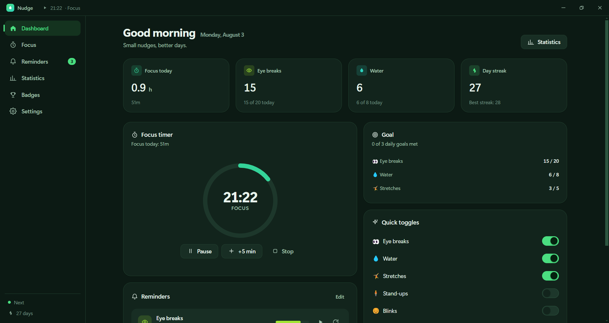
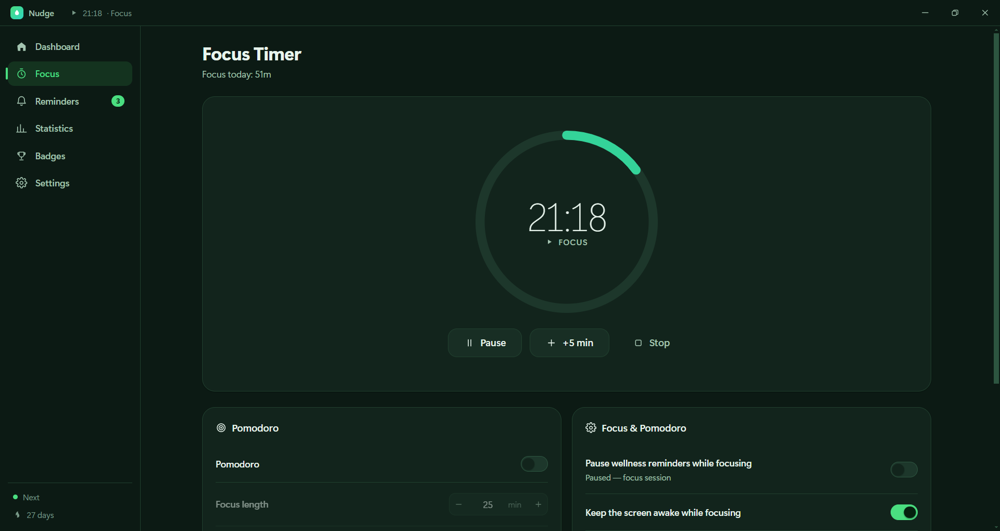
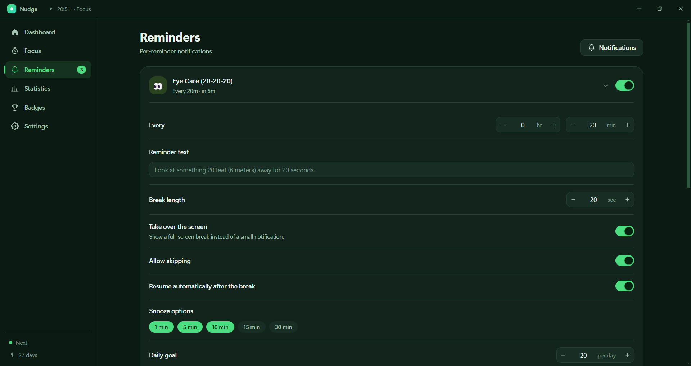
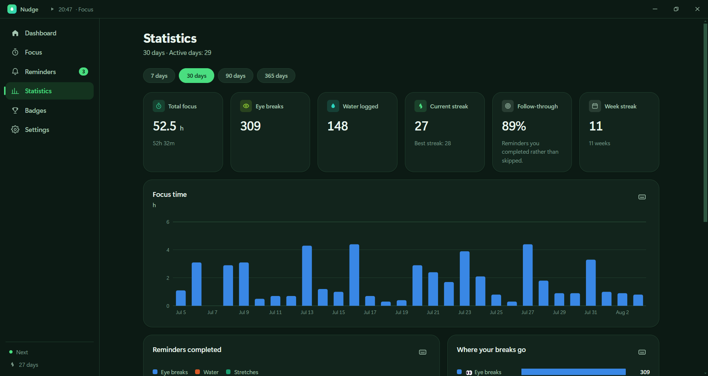
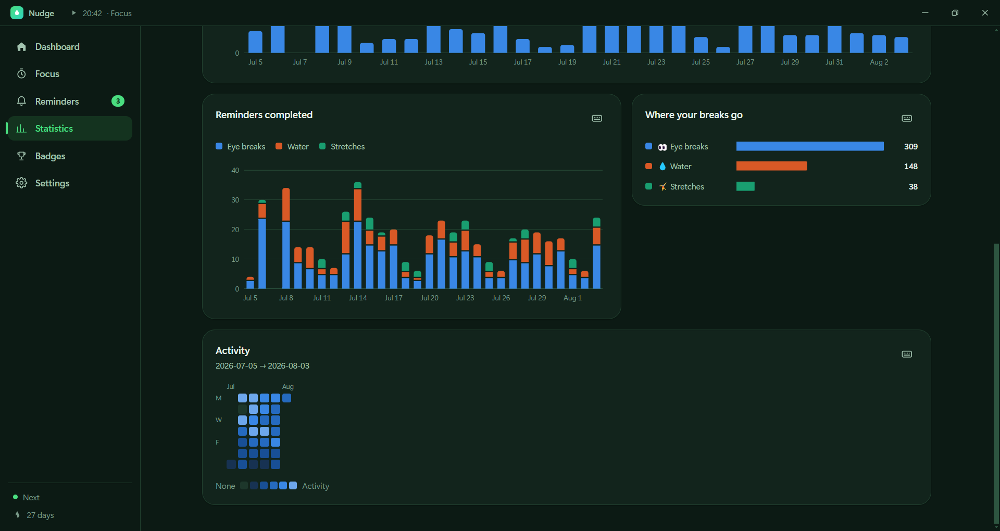
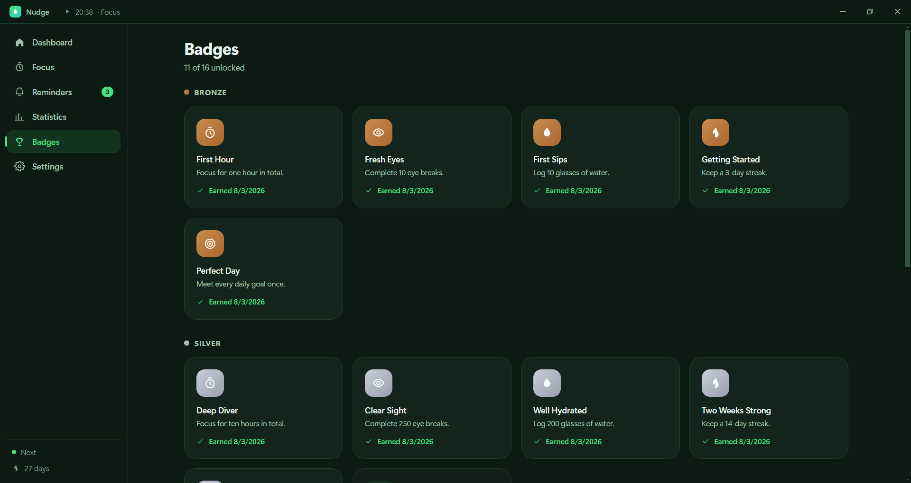
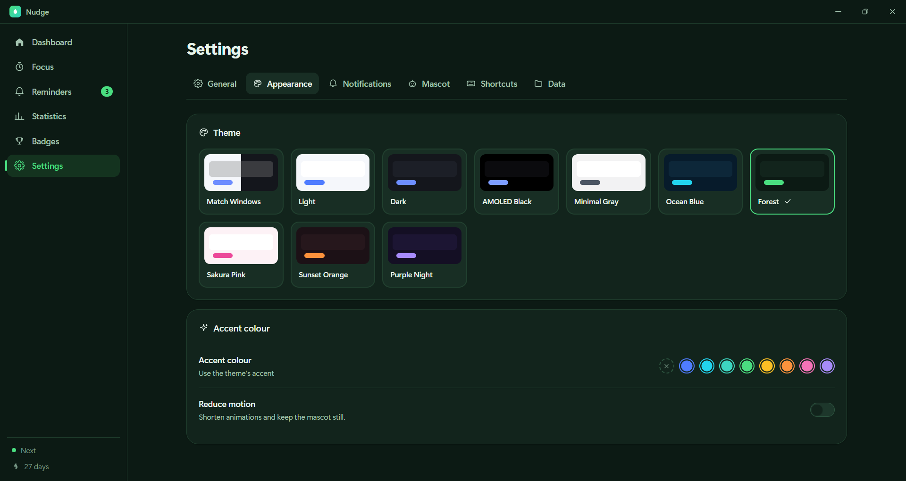
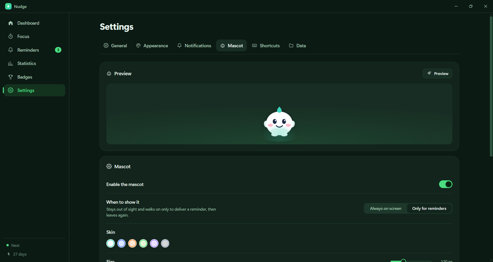
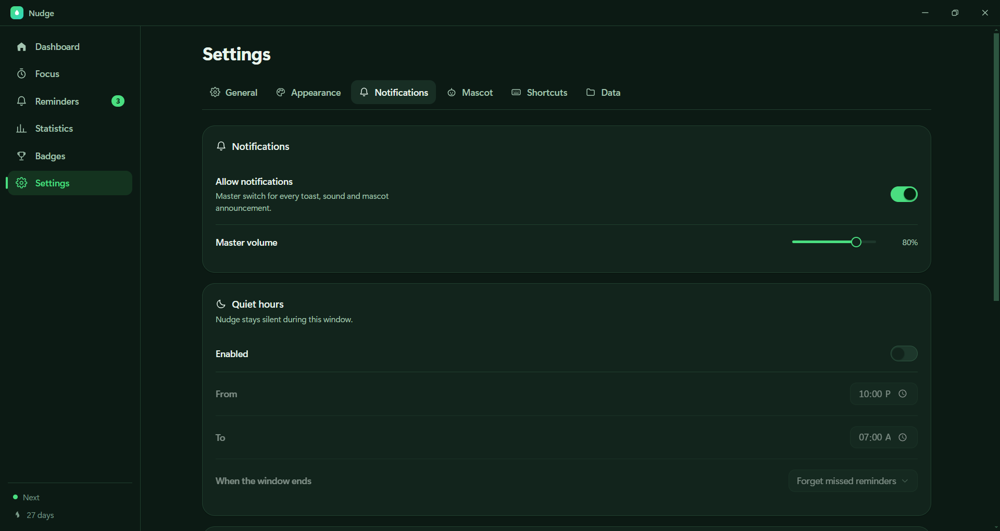

# Nudge

A desktop productivity and wellness companion. Eye-care breaks, hydration
reminders, a focus timer, and a small character who lives on your desktop and
walks over when something needs your attention.

Windows-first, architected to go cross-platform.



---

## Quick start

```bash
npm install       # also generates the icon assets
npm run dev       # hot-reloading dev build
npm test          # 77 unit tests over the pure logic
npm run dist:win  # NSIS installer in release/1.0.0/
```

No native modules — no Python, no Visual Studio Build Tools, no `node-gyp`.
Full instructions: **[docs/BUILD.md](docs/BUILD.md)**

---

## Screens

### Dashboard

Answers four questions in the order they get asked: *is anything paused?* ·
*how am I doing today?* · *what is my timer doing?* · *when is the next nudge?*
Reminder rows turn accent-washed when one is waiting on you, and every row has
its two most useful actions one click away.


### Focus timer

A plain timer or a Pomodoro chain. Pause, resume, extend by five, or skip a
phase. Pomodoro settings sit beside the timer rather than on a separate screen,
because the decision to use Pomodoro is made while looking at the clock.



### Reminders

One collapsible card per reminder. Every control is rendered from the reminder's
declared *capabilities*, so a reminder without a timed break simply has no
break-length row — there is no per-kind branching anywhere in the UI. Adding a
new reminder type (built-in or plugin) makes a fully-configurable card appear
here with no code change.



### Statistics

One filter row scopes every chart on the page. Charts are hand-drawn SVG built
to a fixed spec: 24px bar cap, 4px rounded data-end square at the baseline, 2px
surface-coloured gaps between stacked segments, hairline solid gridlines.



The series palette is **validated for colour-vision deficiency** rather than
eyeballed — worst adjacent CVD ΔE 9.1 light / 8.4 dark, normal-vision ΔE 19.6 /
19.3. Every chart also ships a legend, direct value labels and a table-view twin,
because three light-mode slots sit below 3:1 contrast.



### Badges

Sixteen achievements grouped by tier. Locked badges show real progress rather
than a question mark — knowing you are 7 breaks from "Fresh Eyes" is motivating;
a grey box is not. The first badge in every track is reachable on day one.



### Themes

Nine themes, including true-black AMOLED. Each swatch is a miniature of the app —
page, card, accent — which reads far faster than a row of colour chips. An
optional accent override derives its hover, soft and foreground steps
automatically, picking black or white text by WCAG contrast so a custom colour
can never produce unreadable buttons.



### Mascot

A live preview using the same component that runs on the desktop. Six skins,
adjustable size and walking speed, per-monitor placement, and a choice between
living on your desktop or **only appearing when it has something to tell you**.



### Notifications

Four independently switchable channels per feature — OS toast, sound, mascot,
in-app banner — plus quiet hours that wrap midnight and both manual and timed
Do Not Disturb.



---

## The desktop mascot

The mascot lives in a transparent, click-through strip pinned to a screen edge.
**The window never moves** — the character walks inside it via CSS transforms,
which is what makes the walk cycle a GPU-composited 60 fps instead of a stream of
un-vsynced window moves.

```
                                      ╭────────────────────────╮
                                      │ 💧 Time to drink some  │
                                      │    water!              │
                                      ╰───────────╮╭───────────╯
                                                  ╰╯
                                              (◕‿◕)
════════════════════════════════════════════════════════════════════
 ← 0                    display width                     width →
   ↑ home (18%)                    ↑ walks to centre to announce
```

It wanders, idles, looks around, waves, sleeps when you step away, and wakes when
you come back. When a reminder fires it walks to centre, knocks on the screen and
shows a speech bubble. The whole character is live SVG — crisp from 64px to
260px, and a skin is a six-colour palette swap.

Full design notes: **[docs/MASCOT.md](docs/MASCOT.md)**

---

## Break overlay

```
╔═══════════════════════════════════════════════════════════════════╗
║                          (◕‿◕)                                    ║
║                       ╭─────────────╮                             ║
║                     │       14        │                           ║
║                       ╰─────────────╯                             ║
║                            👀                                     ║
║        Look at something 20 feet (6 meters) away for 20 seconds.  ║
║      ( I'm done )   ( Snooze 1 min )( Snooze 5 min )   ( Skip )   ║
║                       Press Esc to skip                           ║
╚═══════════════════════════════════════════════════════════════════╝
```

A break covers **every** display — dimming one screen while you keep reading the
other defeats the point. The scrim is translucent and themed, so it reads as a
pause rather than a lockout.

---

## System tray

```
  ┌────────────────────────────────┐
  │ Open Nudge                     │
  ├────────────────────────────────┤
  │ Start focus timer            ▸ │──┬─ Focus for 15 / 25 / 45 / 60 min
  ├────────────────────────────────┤  │
  │ 👀  Start eye break            │  │
  │ 💧  Drink water now            │  │
  ├────────────────────────────────┤  │
  │ ☐ Do Not Disturb               │  │
  │ Pause for                    ▸ │──┴─ 30 / 60 / 120 minutes
  │ ☑ Show mascot                  │
  ├────────────────────────────────┤
  │ Quit Nudge                     │
  └────────────────────────────────┘

  Tooltip:  "Nudge — Focus · 24:13 left"
            "Nudge — Next: Eye breaks in 12m"
```

---

## Features

| Feature | Summary |
|---|---|
| **20-20-20 eye care** | Every 20 min, a full-screen 20-second break with countdown, skip and snooze. |
| **Water** | Interval or fixed times of day, custom message, daily goal. |
| **Focus timer** | Plain timer or Pomodoro chains; pause/resume/extend; keeps the screen awake. |
| **Stretch / stand-up / blink** | Same engine, shipped switched off. |
| **Mascot** | Walks, idles, sleeps, waves, knocks, delivers reminders. Six skins. Optionally on-demand only. |
| **Themes** | Nine, including AMOLED black; optional accent override. |
| **Statistics** | Streaks, follow-through, per-day charts, activity calendar, table views. |
| **Badges** | 16 achievements with live progress. |
| **Tray** | Live countdown tooltip, quick focus start, reminder shortcuts, DND. |
| **Quiet hours & DND** | Wrapping time window plus manual and timed Do Not Disturb. |
| **Shortcuts** | Global accelerators plus in-window keys (`1`–`6`, `Space`, `Ctrl+,`). |
| **Data** | Export/import settings, open the data folder, clear statistics. |
| **Plugins** | Add a reminder type with a `plugin.json` — data only, no code execution. |
| **i18n** | English, Spanish, German, Nepali, with per-key fallback and a coverage badge. |

---

## Architecture at a glance

Three processes, four renderer documents, one heartbeat.

```
┌──────────────────────── MAIN (Node) ─────────────────────────┐
│  AppController — composition root, single 1 Hz tick          │
│    ├── SettingsRepository ─┐                                 │
│    ├── ActivityRepository ─┼─> JsonStorageAdapter ─> disk    │
│    ├── StatsService ───────┘                                 │
│    ├── ReminderEngine ──┐                                    │
│    ├── FocusTimerService┼──> NotificationService ─┐          │
│    └── WindowManager <──┘                         │          │
└───────────────────┬───────────────────────────────┼──────────┘
                    │  preload (contextBridge)      │
┌───────────────────▼───────────────────────────────▼──────────┐
│  index.html      overlay.html      mascot.html    sound.html │
│  dashboard       break overlay     desktop pet    audio host │
└──────────────────────────────────────────────────────────────┘
```

**Five rules everything follows:**

1. **Main owns the clock.** Renderers render countdowns; they never compute them.
2. **One typed IPC contract.** A shape change breaks the build in all three processes.
3. **Domain services never import Electron.** They depend on narrow ports, so the scheduler is testable without a browser.
4. **A reminder is data, not code.** One catalog entry adds a reminder everywhere.
5. **Untrusted input is normalised at one boundary.** Downstream code assumes totality, bounds and valid enums.

Full detail: **[docs/ARCHITECTURE.md](docs/ARCHITECTURE.md)**

---

## Documentation

| Document | What it covers |
|---|---|
| [ARCHITECTURE.md](docs/ARCHITECTURE.md) | Processes, layers, folder structure, component hierarchy, data flow |
| [WIREFRAMES.md](docs/WIREFRAMES.md) | Every screen, drawn |
| [STORAGE.md](docs/STORAGE.md) | On-disk format, schema, migrations, the SQLite swap |
| [THEMING.md](docs/THEMING.md) | Token contract and how to add a theme |
| [MASCOT.md](docs/MASCOT.md) | Character construction, animation system, behaviour brain |
| [NOTIFICATIONS.md](docs/NOTIFICATIONS.md) | The four channels, gating rules, sound synthesis |
| [PLUGINS.md](docs/PLUGINS.md) | Writing a reminder plugin |
| [IMPLEMENTATION-PLAN.md](docs/IMPLEMENTATION-PLAN.md) | The build order, as executed |
| [BUILD.md](docs/BUILD.md) | Toolchain, scripts, packaging, code signing |
| [ROADMAP.md](docs/ROADMAP.md) | What to build next, and what to be careful about |

---

## Stack

TypeScript · React 18 · Zustand · Electron 33 · electron-vite · CSS Modules · Vitest

One runtime dependency (`electron-updater`). No UI framework, no charting
library, no icon package, no animation library, no date library — each omission
is justified in
[ARCHITECTURE.md § Dependency policy](docs/ARCHITECTURE.md#7-dependency-policy).

Bundle: `out/main` 184 KB · dashboard ~466 KB · mascot 14 KB.

---

## Privacy

No account, no telemetry, no network calls. Everything stays in
`%APPDATA%/nudge`. The only outbound request the app can make is an update check,
and that is disabled unless a publish provider is configured.

---

## Licence

MIT
